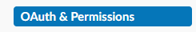
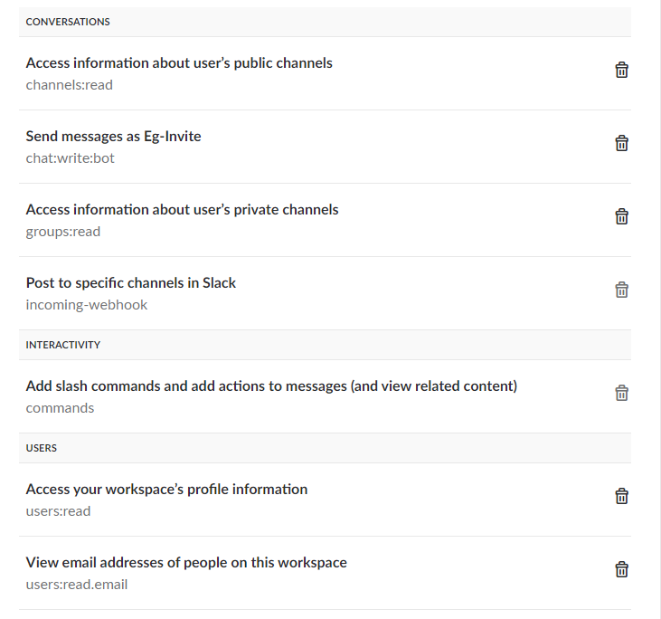
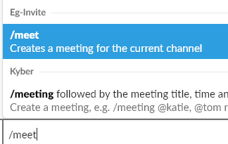
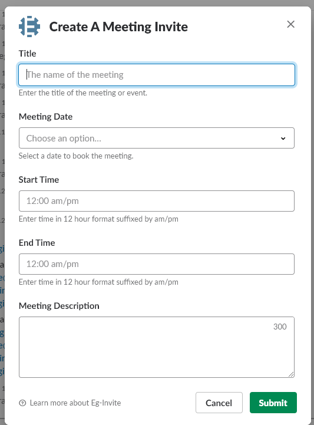

Created in 2018

# Slack Meeting Invite

This project provides a means to integrate Outlook meeting creation with Slack.

Setup
---

### Setting up Slack


1. To set up the app initially, you will need to create a slack app in your workspace: https://api.slack.com/apps

2. Once the app is created, create a slash command and turn `Interactive Components` on. The slash commands URL will target the `SlackEventInvite` function. Set its value to `https://[YourURL]/api/SlackEventInviteFunction`
3. Interactive components needs a Request URL to return the dialog's `POST` data. This will be the `SlackMeetingRequest` function. Set its value to `https://[YourURL]/api/SlackMeetingRequestFunction`
4. Navigate to the `OAuth & Permission` section on https://api.slack.com and provide the following:
 



5. The last thing you need to get up and running is the `OAuth Access Token` for the workspace. You can acquire this near the top of the `OAuth & Permissions` page. Store this in your localsettings.json for future use.
6. Add the following Key/Value pairs to your `localsettings.json` or wherever you are storing your config items (Key Vault, Azure Env, etc.)

```
    "slackoauthToken": "{OauthTokenFromSlack}",
    "slackGroupApiUri": "https://slack.com/api/groups.info?channel=",
    "slackChannelApiUri": "https://slack.com/api/channels.info?channel=",
    "slackUserApiUri": "https://slack.com/api/users.info?user=",
    "slackDialogApiUri": "https://slack.com/api/dialog.open"
```


Legend:

1. **slackoauthToken**: The key you copied from step 5 above.
2. **slackGroupApiUri**: This is the endpoint for groups (private channels). It takes a group/channel Id
3. **slackChannelApiUri**: This is the endpoint for channels. It takes a channel Id
4. **slackUserApiUri**: This is the endpoint for user data. It takes a user Id
5. **slackDialogApiUri**: This is the endpoint to show a dialog in a Slack workspace. It takes a Dialog item. There is a model in the project to represent this already.

### Setting up Outlook

1. Add the following to your `localsettings.json` (or wherever config items are located.)
```
    "serverName": "https://outlook.office365.com/EWS/Exchange.asmx",
    "outlookServiceAccountName": "{myEmailAddress}",
    "outlookServiceAccountPassword": "{myEmailPassword}",
```

ServerName will be where your instance of `ExchangeService` attempts to connect. The .NET Standard EWS API does not currently have support for OAuth so you will need to use your own credentials, or preferably a service account to test with.

### Local debugging

Once you have all of the parameters above configured, you can now test the application. This is most easily done using a tool like [ngrok](https://ngrok.com/).

Use
`ngrok http [PORT]` to create a tunnel to `localhost:[PORT]`. You can then update your Slack endpoints on **BOTH** your slash command and your interactive components.
This will allow you to run and debug the application locally without having to deploy.

### In Slack

The function is activated with your slash command set up above.



Running this command should present you with a dialog:



Production Deployment
---

The app can be deployed from Visual Studio by right-clicking the `.csproj` and selecting `Publish`
Slack API endpoints must be updated as well.

